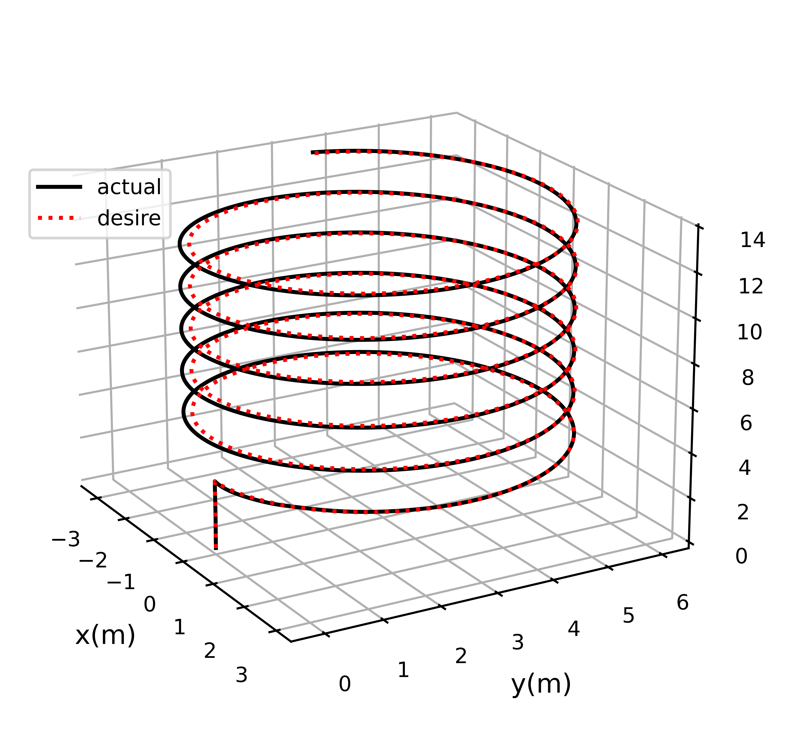

<div align="center">
    <h1>Quadrotor Geometric Control Simulation</h1>
    <br>
    <a href="https://github.com/thecatinbed" target="_blank">Rongqin Mo</a>
    <br>
    <br>
    <div class="text-center">
        
    </div>
    <br>
    <a href='https://arxiv.org'></a>  
    <a href="https://www.bilibili.com"></a>  
    <a href="https://www.youtube.com"></a>
</div>

# 1 Updates
* **Jun. 24, 2025** - Initial release of quadrotor simulation project

# 2 Description
This project simulates the dynamics and control of a quadrotor UAV using geometric control methods.

## Project Structure
```
quadrotor-simulation/
├─ controllers/              # Controller implementations
│ └─ geometric_controller.py
├─ model/                    # Quadrotor dynamics model
│ └─ quadrotors_parameters.py
├─ trajectory/               # Trajectory generation
│ └─ trajectory_generator.py
├─ images/                   # Output figures
├─ geometric_control_demo.py # Main simulation script
├─ draw.py                   # 2D plotting utilities
└─ draw3d.py                 # 3D visualization tools
```
# 3 Results

## 3.1 Simulation Results
<div align="center">

| Position Tracking Error | Attitude Response | 3D Flight Trajectory |
| :---------------------: | :---------------: | :------------------: |
|  |  |  |

</div>

# 4 Dependency Installation
Required Python packages:
```bash
pip install numpy matplotlib -i https://pypi.tuna.tsinghua.edu.cn/simple
```
# 5 Run Simulation
1. Configure model parameters in `./model/quadrotors_parameters.py`

2. Set controller parameters in `./controllers/geometric_controller.py`

3. Execute main simulation script:
```bash
python geometric_control_demo.py
```
4. Generated figures will be saved in `images/` directory

